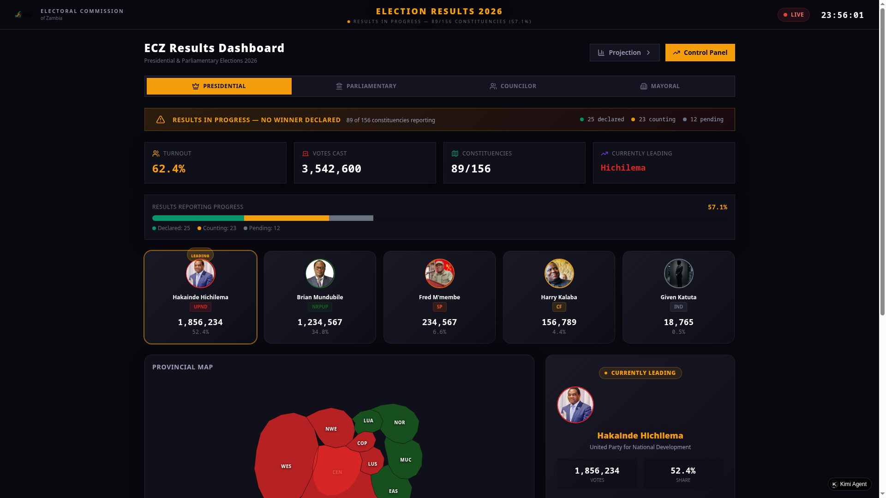
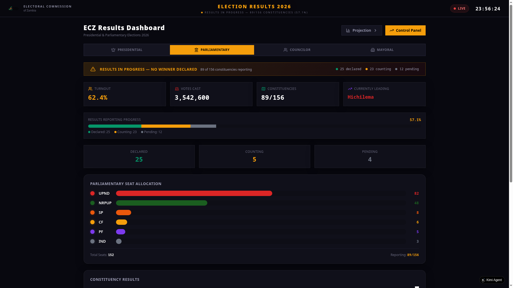
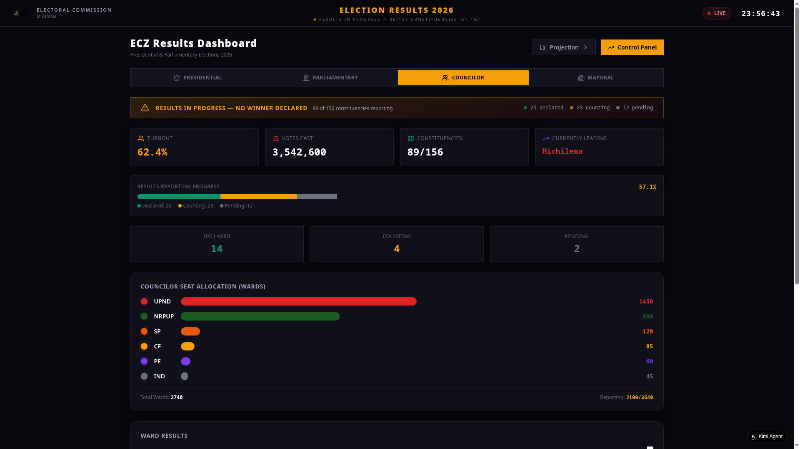
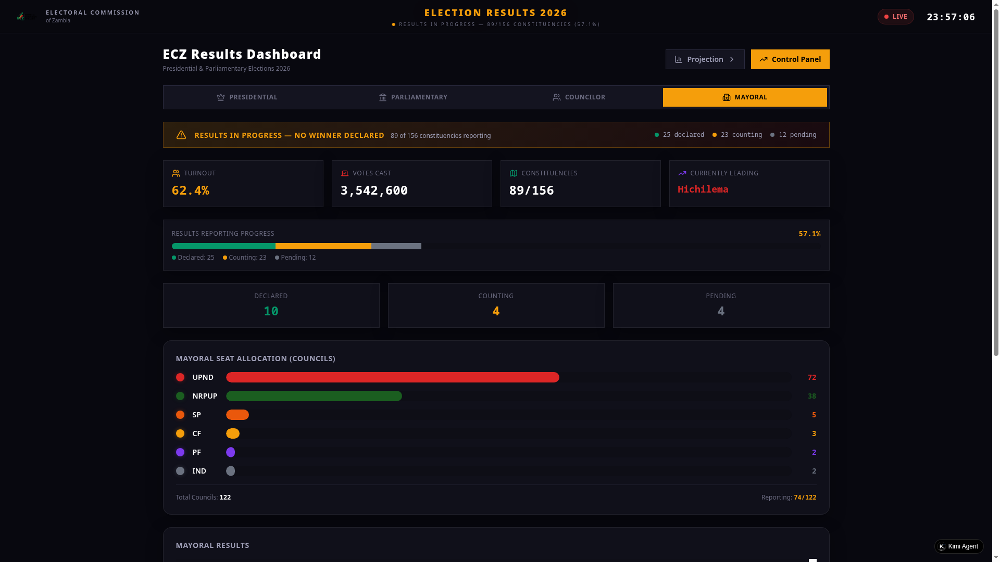
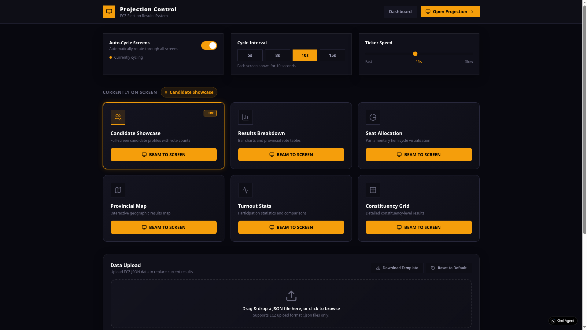
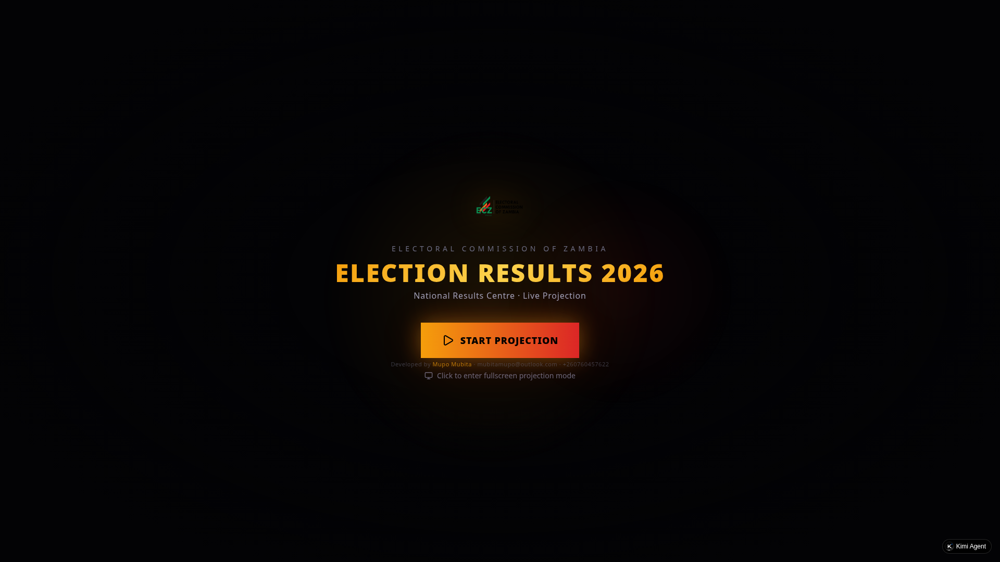

# ECZ Election Results Visualization System 2026

A world-class, broadcast-quality election results visualization system for electoral commissions. Independently developed as a demonstration of professional election coverage capabilities. Adaptable for any electoral body or organization.

## Live Preview
https://mubita767.github.io/ecz-election-results-2026

## Screenshots

### Presidential Election Dashboard


### Parliamentary Election Dashboard


### Councilor Election Dashboard


### Mayoral Election Dashboard


### Control Panel


### Projection Mode — Entry Screen


## Features

- **Presidential, Parliamentary, Councilor, and Mayoral** election coverage
- **Interactive Zambia provincial map** with real province boundaries
- **Cinematic opening montage** (60 seconds, 7 animated scenes)
- **Live projection mode** with fullscreen support
- **Real-time data upload** from control panel
- **4-election-type switcher** dashboard
- **Broadcast-quality graphics** inspired by CNN, BBC, NYT election coverage
- **All assets local** — works completely offline
- **Real candidate photos** and official logos

## Elections Covered

| Election | Total Races | Status |
|----------|-------------|--------|
| Presidential | 5 candidates | Counting |
| Parliamentary | 156 constituencies | 89/156 reported |
| Councilor | 3,640 wards | 2,100/3,640 reported |
| Mayoral | 122 councils | 74/122 reported |

## Technology Stack

- React 19 + TypeScript + Vite 7
- Tailwind CSS + shadcn/ui
- GSAP animations + Framer Motion
- Zustand state management
- Interactive SVG maps
- Recharts data visualization

## Upload Format

The system accepts JSON data uploads via the Control Panel:

```json
{
  "candidates": [
    {
      "name": "Candidate Full Name",
      "party": "Party Full Name",
      "partyShortName": "SHORT",
      "partyColor": "#DC2626",
      "votes": 100000,
      "percentage": 50.0
    }
  ],
  "constituencies": [
    {
      "name": "Constituency Name",
      "province": "Province Name",
      "status": "declared",
      "winner": "Winner Name",
      "winnerParty": "Party Name",
      "winnerPartyColor": "#DC2626",
      "votes": 25000,
      "turnout": 65.0
    }
  ],
  "provinces": [
    {
      "name": "Province Name",
      "code": "ABC",
      "leadingParty": "Leading Party",
      "partyColor": "#DC2626",
      "turnout": 65.0,
      "constituenciesReported": 10,
      "constituenciesTotal": 15
    }
  ],
  "summary": {
    "totalRegistered": 8000000,
    "totalVotesCast": 4000000,
    "constituenciesTotal": 156,
    "constituenciesReported": 100
  },
  "ticker": [
    {
      "text": "Your ticker message here",
      "partyColor": "#DC2626",
      "type": "result"
    }
  ]
}
```

## System Architecture

```
Dashboard (/)          — Main results dashboard with 4 election types
Projection (/#/projection) — Fullscreen broadcast mode with montage
Control Panel (/#/control) — Data upload, ticker control, screen management
```

## Disclaimer

This system was independently developed as a demonstration of broadcast-quality election visualization capabilities. It is **not** an official ECZ product. The candidate names, party affiliations, and vote data used are for demonstration purposes and do not reflect actual election results. Any electoral commission or organization interested in using this system should contact the developer.

## Developed By

**Mupo Mubita**
- Email: mubitamupo@outlook.com
- WhatsApp: +260760457622

All Rights Reserved. This is proprietary software.
The complete source code is maintained privately by the developer.

For licensing or customization inquiries, please contact via email or WhatsApp.
